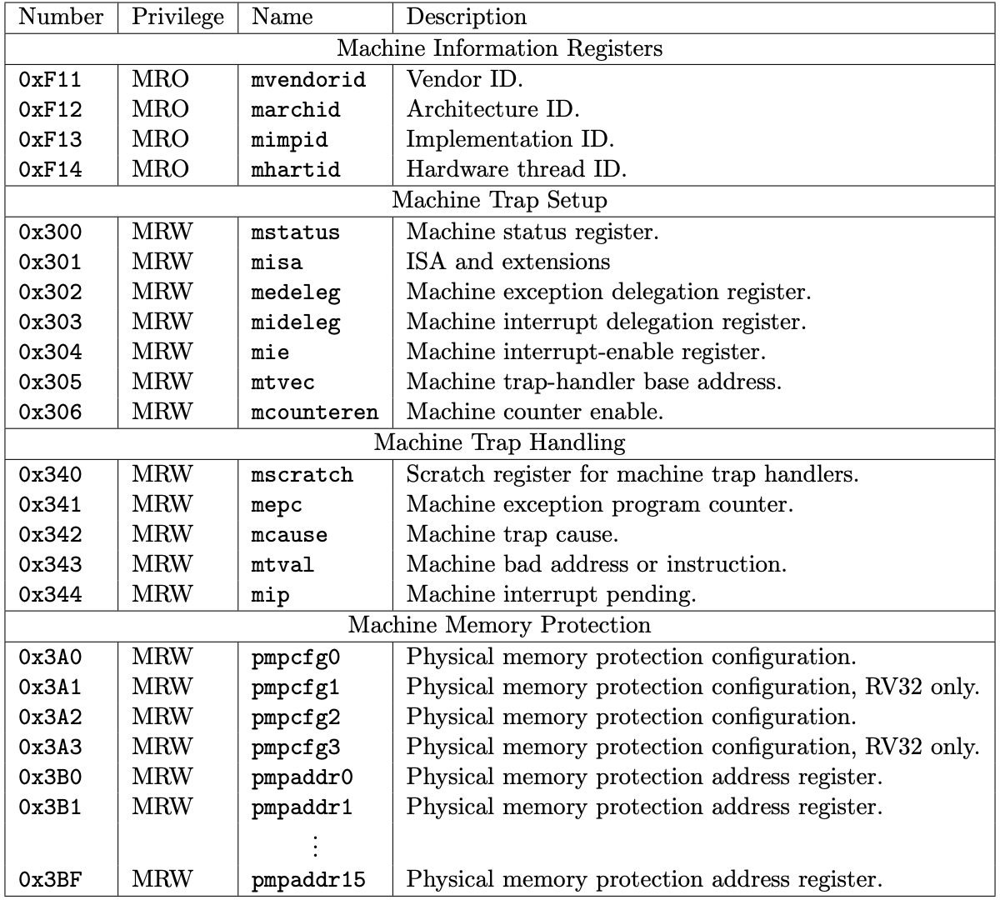

# Control and Status Registers

This is the step 3 of the book [_Writing a RISC-V Emulator from Scratch in 10 Steps_](./), whose goal is running [xv6](https://github.com/mit-pdos/xv6-riscv), a small Unix-like OS, in your emulator in the final step.

The source code is available at [d0iasm/rvemu-for-book/step3/](https://github.com/d0iasm/rvemu-for-book/tree/master/step3).

## Goal of This Page

In the end of this page, we can execute the sample file containing CSR instructions, `csrrw`, `csrrs`, `csrrc`, `csrrwi`, `csrrsi`, and `csrrci`.

## Control and Status Registers \(CSRs\)

Control and status register \(CSR\) is a register that stores various information in CPU. RISC-V defines a separate address space of 4096 CSRs associated with each hardware thread so we can have at most 4096 CSRs. RISC-V only allocates a part of address space so we can add custom CSRs if we want. Also, not all CSRs are required on all implementations. In this book, I'll describe only CSRs used in [xv6-riscv](https://github.com/mit-pdos/xv6-riscv).

First, we're going to add `csrs` field to `Cpu` structure. We already defined registers, a program counter, and memory and now we have 4 fields in CPU.


```rust
pub struct Cpu {
    /// 32 64-bit integer registers.
    pub regs: [u64; 32],
    /// Program counter to hold the the memory address of the next instruction that would be executed.
    pub pc: u64,
    /// Control and status registers. RISC-V ISA sets aside a 12-bit encoding space (csr[11:0]) for
    /// up to 4096 CSRs.
    pub csrs: [u64; 4096],
    /// Computer memory to store executable instructions and the stack region.
    pub memory: Vec<u8>,
}
```


## CSR Instructions

Fig 3.4 is the list for instructions to read-modify-write CSRs. RISC-V calls the 6 instructions _Zicsr._ CSR specifier is encoded in the 12-bit `csr` field of the instruction held in bits 31–20. There are 12 bits for specifying which CSR is selected so it means we have 4096 CSRs \(=2\*\*12\). The `uimm` field is unsigned immediate value, a 5-bit zero-extended.


## CSR List

Fig 3.1-3.3 list the CSRs that are currently allocated CSR addresses.




## Testing

