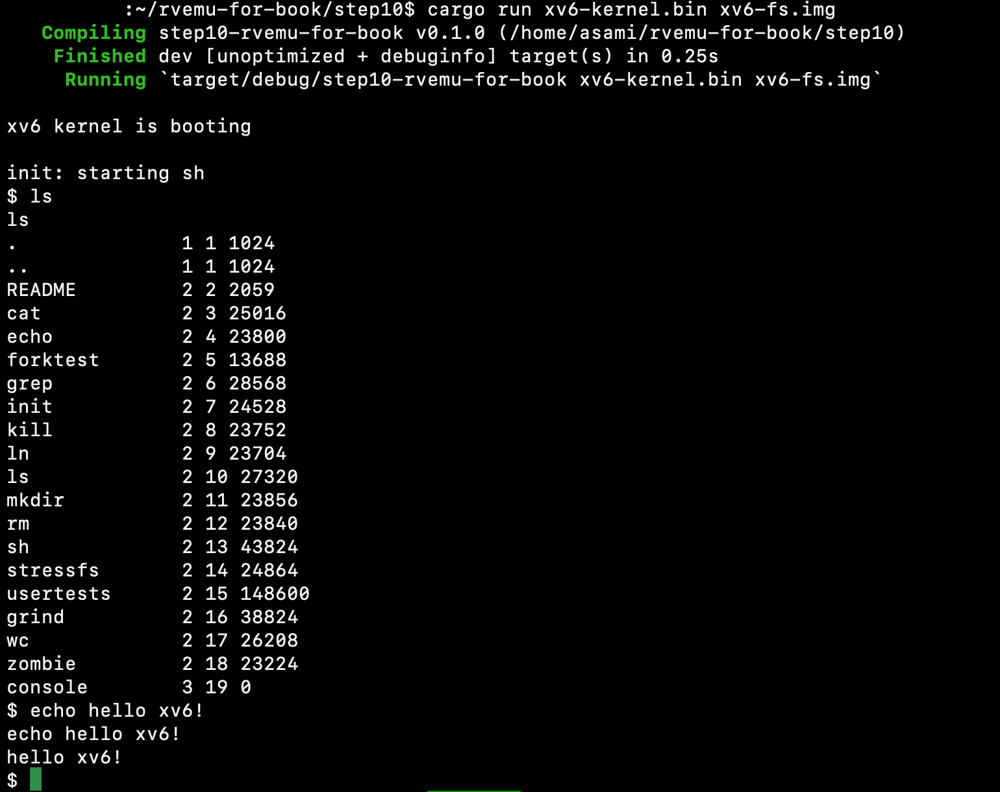

# Writing a RISC-V Emulator in Rust

**NOTE: This project is actively ongoing. Pages are not perfect and they can change soon.**

## Introduction

This is the book for writing a 64-bit RISC-V emulator from scratch in Rust. It shows us how to implement an emulator in 10 steps. You can run [xv6](https://github.com/mit-pdos/xv6-riscv), a simple Unix-like OS, in your emulator in the final step.

You'll learn the following basic computer architecture from making an emulator in Rust:

* Basic RISC-V architecture
* Instruction sets
* Privileged architecture
* Exceptions
* Interrupts
* Peripheral devices
  * UART
  * PLIC
  * CLINT
  * Virtio
* Virtual memory system

The source code is available at [d0iasm/rvemu-for-book](https://github.com/d0iasm/rvemu-for-book).

## Chapter 1

[Chapter 1][hardware-components/README.md] shows all hardward components we need to implement for running `xv6`.

1. [CPU with Two Instructions](hardware-components/cpu-with-two-instructions.md)
2. [Memory and System Bus](hardware-components/memory-and-system-bus.md)
3. [Control and Status Registers](hardware-components/control-and-status-registers.md)
4. [Privileged Architecture](hardware-components/privileged-architecture.md)
5. [Exceptions](hardware-components/exceptions.md)
6. [PLIC \(a platform-level interrupt controller\) and CLINT \(a core-local interrupter\)](hardware-components/plic-a-platform-level-interrupt-controller-and-clint-a-core-local-interrupter.md)
7. [UART \(a universal asynchronous receiver-transmitter\)](hardware-components/uart-a-universal-asynchronous-receiver-transmitter.md)
8. [Interrupts](hardware-components/interrupts.md)
9. Virtio
10. Virtual Memory System

## Chapter 2

[Chapter 2](instruction-set/README.md) shows all ISAs we need to implement for running `xv6`.

## Outcome

Congratulations🎉
Once you read this book and implement the emulator, you will be able to run xv6 in your emulator!

The author is [@d0iasm](https://twitter.com/d0iasm) and please feel free to ask and request anything to me via [Twitter](https://twitter.com/d0iasm) or [GitHub issues](https://github.com/d0iasm/rvemu-for-book/issues)!

